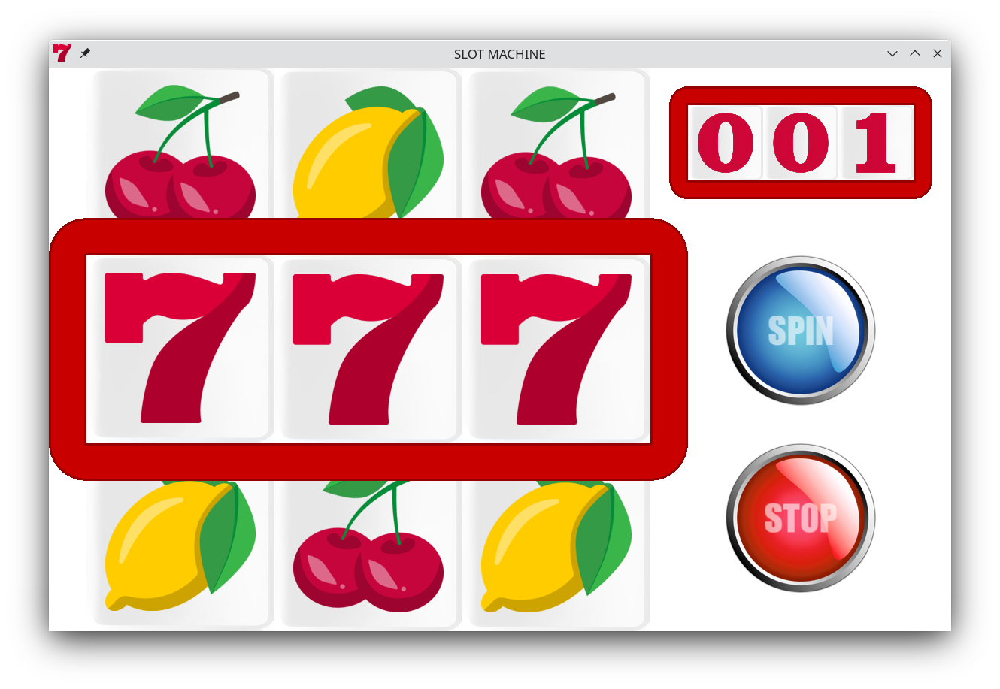

# Проект SlotMachine

Это проект SlotMachine, разработанный с использованием C++ и SFML 3.0.0. Проект реализован с использованием паттерна MVC и машины состояний. Для автоматизации сборки используется `Makefile`. Проект компилирует исполнимый файл slot_machine.



## Структура проекта

SlotMachine/  
├── SFML-3.0.0/  
├── assets/  
│ ├── img/  
│ ├── fonts/  
├── build/  
├── src/  
│ ├── model/  
│ ├── view/  
│ ├── controller/  
│ │ ├── fsm/  
├── Makefile  

- `SFML-3.0.0/` содержит файлы библиотеки SFML (как заголовочные файлы, так и библиотеки).
- `src/` содержит исходный код, организованный по компонентам модели, представления и контроллера.
- `src/controller/fsm` содержит исходный код машины состояний.
- `assets/` хранит ресурсы для игры (изображения и шрифты).
- `build/` — это директория для хранения объектных файлов и итогового исполняемого файла.
- `Makefile` используется для автоматизации процесса сборки.

## Требования

- **C++17**
- **C++ компилятор (g++)**

Библиотека SFML идет вместе с проектом. Для корректной работы не перемещайте исполняемый файл и пользуйтесь `make run` для запуска игры.

## Инструкции по сборке

1. Клонируйте репозиторий или скачайте файлы проекта.
2. Убедитесь, что библиотека SFML находится в корневой директории (на одном уровне с папками `src`, `assets` и `build`).
3. Перейдите в директорию проекта через терминал.
4. Выполните следующую команду для сборки проекта:

```bash
make
```

Это:
- Скомпилирует все `.cpp` файлы в объектные файлы `.o`.
- Слинкует объектные файлы для создания итогового исполнимого файла (`slot_machine`) в директории `build`.

## Запуск проекта

После успешной сборки вы можете запустить проект с помощью следующей команды:

```bash
make run
```

Это запустит программу `slot_machine`, находящуюся в директории `build/`.

## Очистка сборки

Чтобы очистить проект и удалить созданные объектные файлы и исполнимый файл, выполните команду:

```bash
make clean
```

Это:
- Удалит все объектные файлы (*.o).
- Удалит пустые директории в папке build.

Если вам нужно удалить только объектные файлы и пустые директории, используйте команду:
```bash
make clean-objects
```
